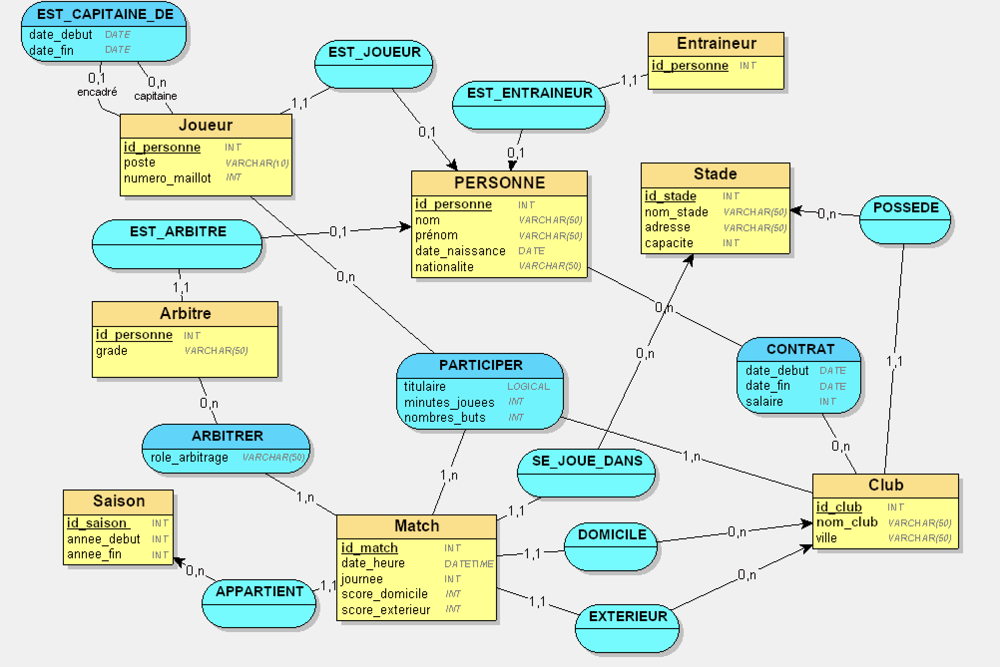

# ProjetDB_NAILI_KARA
Walid KARA /
Walid NAILI

##  Partie 1 

# 📝 Résumé de la Partie 1

Dans cette première partie, nous avons réalisé l’analyse métier d’un système de gestion d’une saison de Premier League en appliquant la méthode MERISE. Nous avons défini les règles de gestion du championnat et construit un dictionnaire de données structuré (type et taille des données). À partir de cette analyse, nous avons ensuite conçu le Modèle Conceptuel de Données (MCD) intégrant une spécialisation, une association n-aire, une association récursive et une association porteuse d’attributs, tout en respectant les principes de normalisation (3FN).

---

# 📊 Réponse – Projet Base de Données - Premier League de Football Anglaise

---

# 1️⃣ Règles de gestion

- Une **personne** est identifiée de manière unique par un identifiant.
- Une personne possède un nom, un prénom, une date de naissance et une nationalité.
- Une personne peut exercer un rôle de **joueur**, **entraîneur** ou **arbitre**.

- Un **joueur** possède un poste et un numéro de maillot.
- Un **arbitre** possède un grade.

- Un joueur peut être **capitaine** d’autres joueurs sur une période donnée (date_debut, date_fin).
- Un joueur peut avoir au maximum **un seul capitaine** à un instant donné.

- Un **club** est identifié de manière unique.
- Un club possède un nom et une ville.
- Un club possède un stade principal.

- Un **stade** est identifié de manière unique.
- Un stade possède un nom, une adresse et une capacité.

- Une **saison** est définie par une année de début et une année de fin.

- Un **match** est identifié de manière unique.
- Un match appartient à une seule saison.
- Un match possède une date et heure.
- Un match correspond à une journée du championnat.
- Un match oppose exactement deux clubs : un club domicile et un club extérieur.
- Un match se joue dans un seul stade.
- Un match possède un score domicile et un score extérieur.

- Un joueur participe à un match pour un club donné.
- Lors d’une participation, on enregistre :
  - s’il est titulaire,
  - le nombre de minutes jouées,
  - le nombre de buts marqués.

- Un arbitre arbitre un match.
- Pour chaque arbitrage, on enregistre le rôle de l’arbitre (central, assistant, VAR).

- Un contrat lie une personne (joueur ou entraîneur) à un club.
- Un contrat possède une date de début, une date de fin et un salaire.

---

# 2️⃣ Dictionnaire de données brutes

| Signification de la donnée | Type | Taille |
|----------------------------|------|--------|
| Identifiant personne | INT | 10 |
| Nom personne | VARCHAR | 50 |
| Prénom personne | VARCHAR | 50 |
| Date naissance | DATE | 10 |
| Nationalité | VARCHAR | 50 |
| Poste joueur | VARCHAR | 20 |
| Numéro maillot | INT | 2 |
| Grade entraineur | VARCHAR | 30 |
| Grade arbitre | VARCHAR | 30 |
| Identifiant club | INT | 10 |
| Nom club | VARCHAR | 60 |
| Ville club | VARCHAR | 60 |
| Identifiant stade | INT | 10 |
| Nom stade | VARCHAR | 60 |
| Adresse stade | VARCHAR | 80 |
| Capacité stade | INT | 6 |
| Identifiant saison | INT | 10 |
| Année début saison | INT | 4 |
| Année fin saison | INT | 4 |
| Identifiant match | INT | 10 |
| Date et heure match | DATETIME | 19 |
| Numéro journée | INT | 2 |
| Score domicile | INT | 2 |
| Score extérieur | INT | 2 |
| Date début contrat | DATE | 10 |
| Date fin contrat | DATE | 10 |
| Salaire | INT | 10 |
| Rôle arbitrage | VARCHAR | 30 |
| Titulaire | BOOLEAN | 1 |
| Minutes jouées | INT | 3 |
| Nombre buts | INT | 2 |
| Date début capitanat | DATE | 10 |
| Date fin capitanat | DATE | 10 |

---

# Image de notre MCD 

