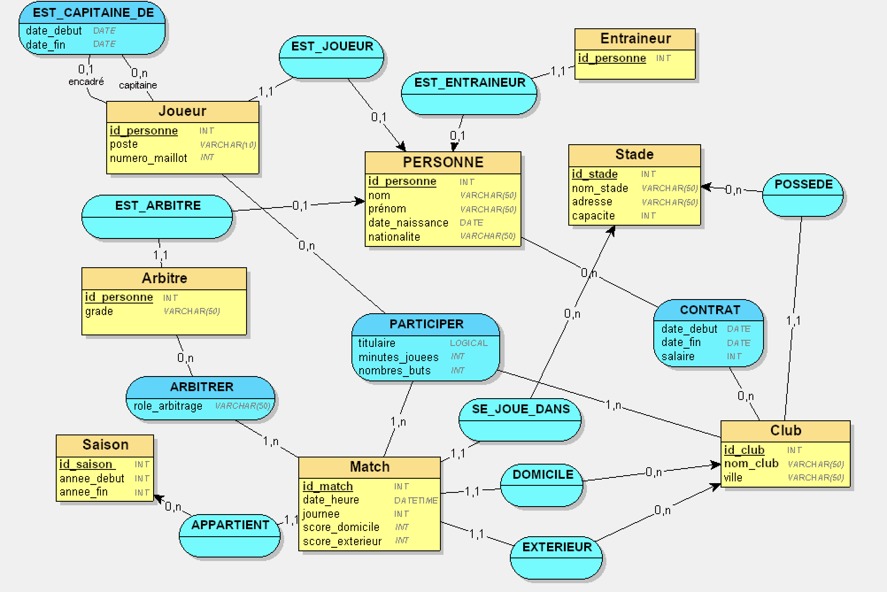

# ProjetDB_NAILI_KARA
Walid KARA /
Walid NAILI

##  Partie 1 

# 📝 Résumé de la Partie 1
Dans cette première partie, nous avons réalisé l’analyse métier d’un système de gestion d’une saison de Premier League en appliquant la méthode MERISE. Nous avons défini les règles de gestion du championnat et construit un dictionnaire de données structuré (type et taille des données). À partir de cette analyse, nous avons ensuite conçu le Modèle Conceptuel de Données (MCD) intégrant une spécialisation, une association n-aire, une association récursive et une association porteuse d’attributs, tout en respectant les principes de normalisation (3FN).

---

# 📊 Réponse au (PROMPT-IAG.md) – Projet Base de Données - Premier League de Football Anglaise

---

# 1️⃣ Règles de gestion

- Une **personne** est identifiée de manière unique par un identifiant.
- Une personne possède un nom, un prénom, une date de naissance et une nationalité.
- Une personne peut exercer un rôle de **joueur**, **entraîneur** ou **arbitre**.

- Un **joueur** possède un poste et un numéro de maillot.
- Un **entraineur** possède un grade.
- Un **arbitre** possède un grade.

- Un joueur peut être **capitaine** d’autres joueurs sur une période donnée (date_debut, date_fin).
- Un joueur peut avoir au maximum **un seul capitaine** à un instant donné.

- Un **club** est identifié de manière unique.
- Un club possède un nom et une ville.
- Un club possède un stade principal.

- Un **stade** est identifié de manière unique.
- Un stade possède un nom, une adresse et une capacité.

- Une **saison** est définie par une année de début et une année de fin.

- Un **match** est identifié de manière unique.
- Un match appartient à une seule saison.
- Un match possède une date et heure.
- Un match correspond à une journée du championnat.
- Un match oppose exactement deux clubs : un club domicile et un club extérieur.
- Un match se joue dans un seul stade.
- Un match possède un score domicile et un score extérieur.

- Un joueur participe à un match pour un club donné.
- Lors d’une participation, on enregistre :
  - s’il est titulaire,
  - le nombre de minutes jouées,
  - le nombre de buts marqués.

- Un arbitre arbitre un match.
- Pour chaque arbitrage, on enregistre le rôle de l’arbitre (central, assistant, VAR).

- Un contrat lie une personne (joueur ou entraîneur) à un club.
- Un contrat possède une date de début, une date de fin et un salaire.

---

# 2️⃣ Dictionnaire de données brutes

| Signification de la donnée | Type | Taille |
|----------------------------|------|--------|
| Identifiant personne | INT | 10 |
| Nom personne | VARCHAR | 50 |
| Prénom personne | VARCHAR | 50 |
| Date naissance | DATE | 10 |
| Nationalité | VARCHAR | 50 |
| Poste joueur | VARCHAR | 20 |
| Numéro maillot | INT | 2 |
| Grade entraineur | VARCHAR | 30 |
| Grade arbitre | VARCHAR | 30 |
| Identifiant club | INT | 10 |
| Nom club | VARCHAR | 60 |
| Ville club | VARCHAR | 60 |
| Identifiant stade | INT | 10 |
| Nom stade | VARCHAR | 60 |
| Adresse stade | VARCHAR | 80 |
| Capacité stade | INT | 6 |
| Identifiant saison | INT | 10 |
| Année début saison | INT | 4 |
| Année fin saison | INT | 4 |
| Identifiant match | INT | 10 |
| Date et heure match | DATETIME | 19 |
| Numéro journée | INT | 2 |
| Score domicile | INT | 2 |
| Score extérieur | INT | 2 |
| Date début contrat | DATE | 10 |
| Date fin contrat | DATE | 10 |
| Salaire | INT | 10 |
| Rôle arbitrage | VARCHAR | 30 |
| Titulaire | BOOLEAN | 1 |
| Minutes jouées | INT | 3 |
| Nombre buts | INT | 2 |
| Date début capitanat | DATE | 10 |
| Date fin capitanat | DATE | 10 |

---

# Image de notre MCD 


##  Partie 2 

# MCD -> MLD

PERSONNE = (id_personne INT, nom VARCHAR(50), prenom VARCHAR(50), date_naissance DATE, nationalite VARCHAR(50));

Stade = (id_stade INT, nom_stade VARCHAR(60), adresse VARCHAR(80), capacite INT);

Saison = (id_saison INT, annee_debut INT, annee_fin INT);

Joueur = (id_personne INT, poste VARCHAR(20), numero_maillot INT);

Entraineur = (id_personne INT, grade VARCHAR(30));

Arbitre = (id_personne INT, grade VARCHAR(30));

Club = (id_club INT, nom_club VARCHAR(50), ville VARCHAR(60), #id_stade);

Match_ = (
    id_match INT,
    date_heure DATETIME,
    journee INT,
    score_domicile INT,
    score_exterieur INT,
    #id_club_domicile,
    #id_club_exterieur,
    #id_saison,
    #id_stade
);

ARBITRER = (
    #id_match,
    #id_personne,
    role_arbitrage VARCHAR(30)
);

CONTRAT = (
    #id_personne,
    #id_club,
    date_debut DATE,
    date_fin DATE,
    salaire INT
);

PARTICIPER = (
    #id_club,
    #id_match,
    #id_personne,
    titulaire BOOLEAN,
    minutes_jouees INT,
    nombre_buts INT
);

EST_CAPITAINE_DE = (
    #id_personne_encadre,
    date_debut DATE,
    date_fin DATE,
    #id_personne_capitaine
);


---

# 🎯 Scénarios d’utilisation

## Scénario 1 : analyste sportif TV

La base de données est utilisée par un **analyste sportif** travaillant pour une chaîne de télévision qui suit la **Premier League anglaise**.

Son rôle est de produire des statistiques avant et après les matchs.

Il doit notamment :

- consulter les résultats des matchs
- identifier les joueurs ayant marqué
- comparer les performances des clubs
- connaître les arbitres ayant officié
- analyser le temps de jeu des joueurs.

Les requêtes SQL permettent donc d’extraire ces informations pour les émissions sportives.

---

## Scénario 2 : cellule de recrutement d’un club

La base de données peut également être utilisée par un **recruteur d’un club de Premier League**.

Son objectif est d’identifier les joueurs intéressants à suivre selon :

- leur nombre de buts
- leur temps de jeu
- leur régularité dans les matchs.

Il peut ainsi :

- repérer les joueurs les plus performants
- identifier les titulaires réguliers
- comparer les joueurs d’un même club
- analyser les clubs qui utilisent le plus certains joueurs.

Ces analyses peuvent servir à **la prise de décision sportive et au recrutement**.

---

# 📁 Structure du projet

```
ProjetDB_NAILI_KARA
│
├── .gitignore
├── 1_creation.sql
├── 2_contraintes.sql
├── 3_insertion.sql
├── 4_interrogation.sql
├── image.png
└── MCD-Projet.loo
└── PROMPT-IAG-insert.md
└── PROMPT-IAG.md
└── README.md
```

- **1_creation.sql** : création des tables et des clés étrangères  
- **2_contraintes.sql** : ajout des contraintes de validation/règles métier  
- **3_insertion.sql** : insertion des données dans la base  
- **4_interrogation.sql** : requêtes SQL d’interrogation et d’analyse  

- **MCD-Projet.loo** : modèle conceptuel réalisé avec le logiciel Looping  
- **image.png** : image exportée du MCD  

- **PROMPT-IAG.md** : prompt utilisé pour générer les règles métier et le modèle conceptuel  
- **PROMPT-IAG-insert.md** : prompt utilisé pour générer les requêtes d’insertion de données